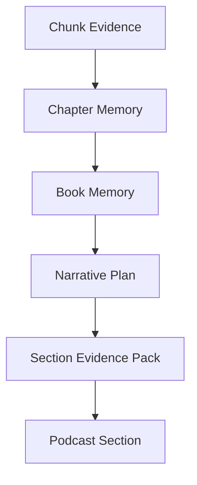

# 📚 Book Studio App

> **Turn books into structured, evidence-grounded long-form podcast scripts using local LLMs.**

**Book Studio App** is a local AI application that analyzes **PDF** and **EPUB** books and transforms them into polished, long-form narrative summaries designed for podcast-style storytelling.

Instead of simply asking an LLM to summarize an entire book, Book Studio processes the book through a multi-stage pipeline:

**extract → analyze → build memory → plan → write → fact-check → refine**

The system is designed to preserve the book's ideas, arguments, characters, examples, and evidence while producing an engaging narrative **without inventing unsupported details**.

Everything is processed locally using **GGUF language models**.

---

## ✨ Features

- 📚 PDF and EPUB book processing
- 🧠 Local GGUF language models
- 🔒 Local-first processing
- 🧩 Token-aware book chunking
- 🗂️ Automatic chapter and structure detection
- 👤 Manual structure review before analysis
- 🔎 Evidence extraction with Qwen
- 🧠 Hierarchical chapter and book memory
- 🗺️ Editable narrative planning
- 🎙️ Long-form podcast-style script generation
- ✅ Claim and evidence verification
- 🎭 Narrative quality scoring
- 🔄 Targeted rewriting of weak sections
- 💾 SQLite checkpoints
- ⏯️ Pause and resume processing
- 🚫 No need to restart a completed book analysis
- ⚡ Fast / fallback model mode
- 📱 Responsive web interface
- 📝 Markdown and TXT output

---

# 🎯 What Book Studio Does

Traditional summarizers often reduce a book to a list of key points.

Book Studio takes a different approach.

It attempts to understand:

- what the book is arguing
- what questions it asks
- how the author answers them
- which examples support the argument
- which people or forces drive the story
- where expectations fail
- where ideas encounter reality
- how the book connects historical, human, technological, and philosophical themes

That information is then transformed into a structured narrative.

```text
Book
  │
  ▼
Extraction
  │
  ▼
Structure Detection
  │
  ▼
Evidence Analysis
  │
  ▼
Chapter Memory
  │
  ▼
Book Memory
  │
  ▼
Narrative Plan
  │
  ▼
Script Drafting
  │
  ▼
Fact Checking
  │
  ▼
Narrative Review
  │
  ▼
Final Podcast Script
```

---

# 🤖 Models

Book Studio is designed around three local models.

### Qwen 2.5 14B

Primary roles:

- book analysis
- evidence extraction
- argument extraction
- structured JSON generation
- claim verification
- fact checking

### Gemma 3 12B

Primary roles:

- narrative planning
- long-form writing
- narrative restructuring
- stylistic editing
- final polishing

### Gemma 3 4B

Used for:

- **Fast Mode**
- lower-memory systems
- fallback processing
- optional single-model workflows

---

## 🧠 Recommended Model Pipeline

```text
          BOOK
           │
           ▼
┌──────────────────────┐
│   Qwen 2.5 14B       │
│                      │
│ • Analyze            │
│ • Extract evidence   │
│ • Identify arguments │
└──────────┬───────────┘
           │
           ▼
┌──────────────────────┐
│   Gemma 3 12B        │
│                      │
│ • Narrative plan     │
│ • Structure          │
│ • Script writing     │
└──────────┬───────────┘
           │
           ▼
┌──────────────────────┐
│   Qwen 2.5 14B       │
│                      │
│ • Fact check         │
│ • Verify claims      │
│ • Detect invention   │
└──────────┬───────────┘
           │
           ▼
┌──────────────────────┐
│   Gemma 3 12B        │
│                      │
│ • Rewrite weak parts │
│ • Final polish       │
└──────────────────────┘
```

The models do **not need to remain loaded at the same time**.

Each model stage can run in a separate worker process so model memory can be released before the next stage begins.

---

# 🔒 Local-First Architecture

Book Studio is designed around local inference.

```text
Your Book
   │
   ▼
Book Studio
   │
   ▼
Local GGUF Model
   │
   ▼
SQLite / Local Files
   │
   ▼
Podcast Script
```

Book content does not need to be sent to a cloud LLM provider as part of the normal processing pipeline.

This is especially useful when working with:

- unpublished manuscripts
- research material
- internal documents
- copyrighted books you are analyzing locally
- privacy-sensitive material

---

# 📖 Supported Input

| Format            |                 Support                 |
| ----------------- | :-------------------------------------: |
| PDF               |                   ✅                    |
| EPUB              |                   ✅                    |
| DOCX              |                   ❌                    |
| TXT               |                   ❌                    |
| Scanned PDF / OCR | Not currently part of the core workflow |

The current workflow is designed primarily around **English-language books**.

---

# 🎙️ Output

Book Studio produces two final files:

```text
outputs/<book-name>-podcast-script.md
outputs/<book-name>-podcast-script.txt
```

The script is designed as a long-form narrative rather than a simple chapter-by-chapter summary.

---

# ⏱️ Script Length

The user can select a target duration such as:

```text
50 minutes
60 minutes
70 minutes
```

A typical **60-minute** script targets approximately:

```text
~8,000 words
```

The final word budget is distributed according to the importance and narrative value of the book's material.

---

# 🧩 Processing Pipeline

## 1. Book Extraction

Book Studio begins by extracting and cleaning the book's text.

It attempts to identify:

- table of contents
- introduction
- chapters
- conclusion
- appendices
- structural boundaries

The detected structure is presented to the user before full analysis begins.

The user can:

- review chapters
- rename sections
- correct incorrect boundaries
- confirm the structure

Only after confirmation does deep analysis begin.

---

# ✂️ Token-Aware Chunking

The book is divided according to the tokenizer used by the model rather than a simple character count.

Typical initial settings are approximately:

```text
Chunk size:   ~2,600 tokens
Overlap:      ~200 tokens
Context:      8,192 tokens
```

Each chunk retains metadata such as:

```text
Chapter
Position
Chunk number
Source location
Processing state
```

This allows large books to be processed without placing the complete book inside the model context window.

---

# 🔎 Evidence Extraction

Each chunk is analyzed by **Qwen 2.5 14B**.

The model produces structured evidence rather than free-form notes.

Extracted information may include:

- claims
- arguments
- questions raised by the text
- the author's answers
- documented characters
- motivations
- conflicts
- inventions
- operations
- experiments
- studies
- events
- case studies
- visual or sensory scenes
- conflicts between belief and evidence
- historical dimensions
- human dimensions
- technological dimensions
- philosophical dimensions
- hope
- testing
- failure
- redirection
- consequences
- connection to the book's central thesis
- importance score
- source location

Missing information should remain missing.

The extraction system is explicitly instructed **not to invent material simply to complete the JSON structure**.

---

# 🧠 Hierarchical Memory

Large books cannot reliably fit inside a single LLM context.

Book Studio therefore builds several layers of memory.



Typical memory budgets:

```text
Chapter Memory    ~1,400 tokens
Book Memory       ~2,500 tokens
```

The full evidence remains stored in SQLite.

When a section of the podcast is written, only the evidence relevant to that section is retrieved.

This allows the application to work with large books without forcing the entire source into one prompt.

---

# 🎭 Narrative Planning

Before writing the podcast script, **Gemma 3 12B** creates an editable narrative map.

A typical structure includes:

1. Unexpected hook
2. Central question
3. Key characters or opposing viewpoints
4. Initial promise or hope
5. The idea encounters reality
6. Failure, resistance, or redirection
7. Unexpected consequences
8. Historical interpretation
9. Human interpretation
10. Technological or philosophical interpretation
11. Open-ended conclusion

The narrative plan is shown to the user **before drafting begins**.

---

## Each Narrative Section Contains

A planned section can include:

```text
Narrative objective
Audience question
Central character / viewpoint
Book claim
Permitted evidence
Selected example or scene
Interpretive layer
Connection to previous section
Connection to next section
Word budget
Forbidden inventions
```

The user can review and edit this plan before approving the writing stage.

---

# 👥 Character-Driven Storytelling

When appropriate, Book Studio identifies **two or three central characters or forces**.

These can include:

- a main person
- an opposing person
- a group
- an organization
- a technology
- nature
- another real force present in the book

Book Studio does **not** create fictional characters merely to make the story more dramatic.

If the book is not character-driven, the system can instead organize the narrative around two or three conflicting **ideas or perspectives**.

---

# 🚫 No Invented Drama

A core rule of Book Studio is:

> **Narrative quality must come from the evidence in the book—not from hallucination.**

The application should not invent:

- dialogue
- sensory details
- incidents
- characters
- quotations
- motivations
- causal relationships

that are not supported by the source material.

A dramatic scene can be used when the book actually contains enough evidence for that scene.

Otherwise, the system must remain faithful to what is known.

---

# 🧭 The 9 Narrative Principles

Book Studio evaluates scripts according to nine narrative principles.

### 1. Start with a surprising hook

The opening should create curiosity rather than begin with a generic book description.

### 2. Focus the narrative

Prefer two or three important characters, forces, or competing viewpoints.

### 3. Connect ideas to concrete examples

Abstract arguments should be grounded in evidence from the book.

### 4. Use source-backed imagery

Scenes and sensory details should come from documented material.

### 5. Explore multiple layers

Where appropriate, the narrative can examine:

- historical meaning
- human meaning
- technological meaning
- philosophical meaning

### 6. Explore belief versus reality

Strong narrative moments often occur where expectations encounter contradictory evidence.

### 7. Use a conversational, reflective voice

The output should feel suitable for listening rather than reading like an academic report.

### 8. Create movement

The story should progress through patterns such as:

```text
Hope
  ↓
Experiment
  ↓
Resistance
  ↓
Failure
  ↓
Change
  ↓
Consequence
```

### 9. End with interpretation

The final section should leave room for thought rather than forcing every question into a simplistic conclusion.

---

# ✅ Evidence Verification

After a section is drafted, Qwen performs a separate evidence review.

It checks questions such as:

- Is each specific claim supported?
- Was any dialogue invented?
- Were sensory details invented?
- Was a paraphrase incorrectly presented as a quotation?
- Was causality strengthened beyond the source?
- Was the narrator's interpretation confused with the author's claim?
- Was unsupported information introduced?

Sections with problems are marked for correction.

---

# 🎬 Narrative Quality Review

The narrative is also evaluated against the nine storytelling principles.

Each criterion can receive a score from:

```text
0 = missing
1 = partially achieved
2 = strongly achieved
```

The reviewer evaluates:

- hook
- narrative focus
- concrete examples
- source-grounded imagery
- interpretive depth
- conflict between belief and reality
- conversational voice
- narrative progression
- open-ended conclusion

Weak sections can be rewritten individually.

The complete script does not need to be regenerated simply because one section performs poorly.

---

# 📊 Word Budgeting

For a typical 60-minute / ~8,000-word script, the initial allocation can resemble:

| Narrative Stage               | Approx. Share |
| ----------------------------- | ------------: |
| Hook & central question       |            8% |
| Idea & conflict introduction  |           12% |
| Hope & idea formation         |           15% |
| Real-world tests & evidence   |           25% |
| Failure or redirection        |           18% |
| Consequences & interpretation |           14% |
| Open ending                   |            8% |

The actual allocation is adjusted according to the importance of the source material.

---

## Chapter Importance Scoring

Chapter importance can be weighted approximately as:

| Criterion                         | Weight |
| --------------------------------- | -----: |
| Connection to central thesis      |    30% |
| Argumentative importance          |    25% |
| Narrative / character potential   |    20% |
| Strength of examples & evidence   |    15% |
| Consequences & interpretive value |    10% |

A short but crucial chapter can therefore receive more script time than a much longer but less important chapter.

---

# 💾 Checkpoints & Resume

Book processing can take a significant amount of computation.

Book Studio therefore stores progress in **SQLite**.

If the application is stopped, the project can resume from its last successful stage or chunk.

```text
Process book
    │
    ├── Chunk 1 ✓
    ├── Chunk 2 ✓
    ├── Chunk 3 ✓
    ├── Chunk 4 ...
    │
    ▼
Application closed
    │
    ▼
Application restarted
    │
    ▼
Resume from Chunk 4
```

You do **not** need to upload and process the entire book again.

---

# 🔄 Project States

Book Studio tracks each project through explicit processing states:

```text
UPLOADED
EXTRACTING
STRUCTURE_REVIEW
ANALYZING
PLANNING
PLAN_REVIEW
DRAFTING
FACT_CHECKING
POLISHING
COMPLETED
PAUSED
FAILED
```

These states make long-running jobs easier to inspect, pause, recover, and resume.

---

# 🗃️ Database

Project state is stored in:

```text
data/book_podcast.db
```

The SQLite database contains tables such as:

| Table                | Purpose                                      |
| -------------------- | -------------------------------------------- |
| `projects`           | Project settings, models, duration and state |
| `chapters`           | Detected book structure and chapter text     |
| `chunks`             | Book chunks and analysis status              |
| `evidence`           | Structured evidence extracted by Qwen        |
| `narrative_sections` | Narrative plan, evidence and word budgets    |
| `drafts`             | Script versions and rewrites                 |
| `events`             | Progress information, messages and errors    |

---

# 🧠 Memory Management

Large local language models can consume significant RAM and GPU / Metal memory.

Book Studio avoids keeping Qwen and Gemma loaded simultaneously.

Each model stage can run inside a separate child process:

```text
Flask
  │
  ▼
Start Worker
  │
  ▼
Load Qwen
  │
  ▼
Process
  │
  ▼
Write Result to SQLite
  │
  ▼
Worker Exits
  │
  ▼
Memory Released
  │
  ▼
Start New Worker
  │
  ▼
Load Gemma
```

This keeps the Flask application lightweight and helps ensure model memory is released between pipeline stages.

---

# 📁 Project Structure

A typical installation looks like:

```text
book-podcast-studio/
│
├── app.py
│
├── .venv/
│
├── models/
│
├── books/
│
├── outputs/
│
└── data/
```

### `models/`

Stores local GGUF language models.

### `books/`

Stores imported source books.

### `outputs/`

Contains completed podcast scripts.

### `data/`

Contains the SQLite project database and persistent processing state.

---

# 🚀 Running the App

Enter the project directory.

```bash
cd /path/to/book-podcast-studio
```

Activate the Python environment:

```bash
source .venv/bin/activate
```

Check the application syntax:

```bash
python -m py_compile app.py
```

If no output appears, the syntax check succeeded.

Start the server:

```bash
python app.py
```

Then open:

```text
http://127.0.0.1:5000
```

On macOS, you can open it directly with:

```bash
open http://127.0.0.1:5000
```

---

# 📖 Typical Workflow

```text
1. Upload a PDF or EPUB
             ↓
2. Choose 50 / 60 / 70 minutes
             ↓
3. Review selected models
             ↓
4. Review detected book structure
             ↓
5. Confirm or edit chapters
             ↓
6. Qwen analyzes book chunks
             ↓
7. Chapter memories are created
             ↓
8. Book memory is created
             ↓
9. Gemma creates a narrative plan
             ↓
10. Review and edit the plan
             ↓
11. Approve the word budget
             ↓
12. Gemma drafts the script
             ↓
13. Qwen verifies claims
             ↓
14. Narrative quality is evaluated
             ↓
15. Gemma rewrites weak sections
             ↓
16. Download Markdown / TXT
```

---

# ⏯️ Resuming a Project

If processing was interrupted:

1. Start Book Studio again.
2. Open the existing project.
3. Select **Resume processing**.

The application uses the saved SQLite state and checkpoint information to continue from the last successful processing point.

> Do not delete the database or upload the same book again simply because processing was interrupted.

---

# ⚡ Fast Mode

For lower-memory systems or quicker processing, Book Studio can use:

```text
Gemma 3 4B
```

as the primary model.

The application can also allow the user to manually choose one model for all stages instead of switching between specialized models.

---

# 🛠️ Tech Stack

```text
Python
Flask
SQLite
llama.cpp / GGUF
Qwen 2.5
Gemma 3
PDF processing
EPUB processing
HTML / CSS / JavaScript
```

---

# 🧪 Validation

The application architecture includes checks around areas such as:

- Python syntax
- JavaScript syntax
- SQLite database creation
- word-budget calculations
- structured JSON parsing
- malformed JSON repair
- PDF extraction
- chapter detection
- chunk creation
- checkpoint handling

Actual Qwen and Gemma inference requires the corresponding GGUF models to be available on the machine running Book Studio.

---

# ⚠️ Limitations

Book Studio uses LLMs and should not be treated as an infallible interpretation of a book.

The verification pipeline reduces unsupported claims, but users should still review important output.

Particular care should be taken with:

- academic works
- scientific books
- historical claims
- legal material
- medical material
- direct quotations
- controversial factual claims

The application's goal is to produce a faithful narrative interpretation of the source—not to replace the source itself.

---

# 🗺️ Roadmap

Possible future improvements include:

- additional input formats
- more local model profiles
- configurable context sizes
- improved evidence retrieval
- searchable evidence browser
- citation-aware script generation
- per-claim source references
- additional narrative templates
- multilingual book processing
- podcast audio generation
- speaker / host profiles
- project export and import
- advanced model benchmarking

---

# 🤝 Contributing

Contributions, testing, bug reports, and suggestions are welcome.

For useful bug reports, include information such as:

- operating system
- Python version
- available RAM
- model name
- GGUF quantization
- processing stage
- input format
- complete Terminal error

Please avoid attaching copyrighted books or private source material to public issue reports.

---

<div align="center">

## 📚 Book Studio

**From hundreds of pages to one coherent story.**

`Extract` → `Understand` → `Plan` → `Write` → `Verify`

**Local models · Structured evidence · Narrative summaries**

</div>
